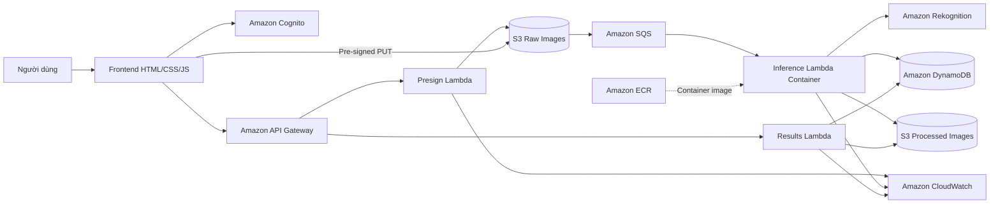

# KTs Smart Agriculture

<p align="center">
  <strong>Serverless crop-disease recognition platform on AWS</strong><br>
  Nền tảng nhận diện bệnh cây trồng từ ảnh lá, được xây dựng theo kiến trúc serverless và hướng sự kiện.
</p>

<p align="center">
  
  
  
  
  
</p>

## Giới thiệu

KTs Smart Agriculture cho phép người dùng đăng ký và đăng nhập bằng Amazon Cognito, tải ảnh lá cây trực tiếp lên Amazon S3 bằng pre-signed URL, sau đó nhận kết quả phân loại bệnh từ mô hình ResNet-50 đã huấn luyện trên PlantVillage. Hệ thống lưu kết quả theo từng người dùng và hỗ trợ xem hoặc xóa lịch sử quét.

Các mục tiêu chính:

- Nhận diện 38 lớp khỏe/bệnh thuộc 14 loại cây trong PlantVillage.
- Kiểm tra ảnh lá bằng Amazon Rekognition trước khi chạy mô hình AI.
- Tách upload và inference bằng pipeline S3 → SQS → Lambda.
- Cô lập lịch sử theo Cognito user ID và kiểm tra quyền sở hữu ở backend.
- Triển khai AI runtime bằng Lambda container image lưu trên Amazon ECR.

> Kết quả chỉ phục vụ mục đích học tập và hỗ trợ tham khảo, không thay thế chẩn đoán chuyên môn trong thực địa.

## Demo

<p align="center">
  <a href="https://youtu.be/PSYT_v13Lr4">
    
  </a>
</p>

<p align="center"><a href="https://youtu.be/PSYT_v13Lr4"><strong>▶ Xem video demo hệ thống</strong></a></p>

### Website production

**[Mở KTs Smart Agriculture](http://kts-smartagri-frontend-929778605917.s3-website-ap-southeast-1.amazonaws.com/)**

Frontend hiện được phục vụ 24/7 bằng Amazon S3 Static Website Hosting tại Region `ap-southeast-1`; máy phát triển không cần duy trì hoạt động.

## Kiến trúc hệ thống



Luồng xử lý chính:

1. Cognito xác thực người dùng và cấp JWT.
2. Presign Lambda tạo URL upload ngắn hạn gắn với người dùng đã đăng nhập.
3. Trình duyệt upload ảnh trực tiếp vào raw S3 bucket.
4. S3 gửi sự kiện qua SQS để kích hoạt Inference Lambda.
5. Rekognition loại ảnh không phù hợp; ResNet-50 phân loại ảnh lá hợp lệ.
6. DynamoDB lưu trạng thái và dự đoán; processed S3 bucket lưu ảnh kết quả.
7. Results Lambda chỉ trả về hoặc xóa dữ liệu thuộc đúng người dùng.

## Công nghệ sử dụng

| Lớp | Công nghệ |
|---|---|
| Frontend | HTML5, CSS3, Vanilla JavaScript |
| Authentication | Amazon Cognito User Pools, JWT |
| API | Amazon API Gateway, AWS Lambda |
| Event pipeline | Amazon S3, Amazon SQS |
| AI inference | Python, PyTorch, TorchVision, Pillow |
| Image validation | Amazon Rekognition `DetectLabels` |
| Data | Amazon DynamoDB, Amazon S3 |
| Container | Docker, Amazon ECR, Lambda container image |
| Monitoring | Amazon CloudWatch |

## Cấu trúc source code

```text
kts-smart-agri/
├── ai-service/
│   ├── aws/
│   │   ├── lambda_inference/       # Lambda container runtime và model metadata
│   │   └── deploy_lambda_container.ps1
│   ├── kaggle/                     # Script huấn luyện và requirements
│   ├── best_lenet_model.pth        # LeNet benchmark checkpoint
│   ├── best_resnet_model.pth       # ResNet-50 production checkpoint
│   └── README.md
├── frontend-app/
│   ├── backend/
│   │   ├── lambda/                 # Presign, Results và legacy inference handlers
│   │   ├── tests/                  # Backend authorization tests
│   │   └── README.md
│   ├── css/                        # Giao diện
│   ├── js/                         # Cấu hình, Cognito auth và application logic
│   ├── index.html                  # Entry point của web app
│   ├── AWS_ARCHITECTURE.md
│   ├── COGNITO_SIGNUP.md
│   ├── DEPLOYMENT.md
│   └── README.md
├── scripts/
│   └── deploy_frontend_s3.ps1   # Deploy/redeploy frontend lên S3 và CloudFront
├── DEPLOYMENT_FIXES.md             # Checklist triển khai AI, history và Cognito
├── .gitignore
└── README.md
```

## Chạy frontend tại máy local

Yêu cầu: Git và Python 3 hoặc một static HTTP server tương đương.

```bash
git clone https://github.com/Toamhuymh306/kts-smart-agri.git
cd kts-smart-agri/frontend-app
python -m http.server 8000
```

Mở `http://127.0.0.1:8000` trên trình duyệt.

Trước khi chạy với môi trường AWS khác, cập nhật các giá trị deployment trong [`frontend-app/js/config.js`](frontend-app/js/config.js):

- Cognito Region, User Pool ID và App Client ID.
- API Gateway endpoint.
- Raw/processed S3 bucket names.

Không commit access key, secret key, JWT, pre-signed URL hoặc tệp `.env` chứa thông tin bí mật.

## Chạy kiểm thử

Backend Results Lambda có bộ test cô lập để kiểm tra authorization và thao tác xóa dữ liệu:

```bash
python -m unittest discover -s frontend-app/backend/tests -p "test_*.py" -v
```

Kiểm tra cú pháp các tệp Python chính:

```bash
python -m compileall ai-service/aws/lambda_inference frontend-app/backend/lambda
```

## Huấn luyện và AI inference

- `best_resnet_model.pth`: ResNet-50, mô hình mặc định cho production inference.
- `best_lenet_model.pth`: LeNet, dùng làm baseline/benchmark.
- `MODEL_NAME=resnet` hoặc `MODEL_NAME=lenet`: lựa chọn checkpoint khi chạy Lambda container.
- Input được resize về `224 × 224` và chuẩn hóa theo cấu hình trong model metadata.

Xem hướng dẫn chi tiết tại [`ai-service/README.md`](ai-service/README.md).

## Triển khai AWS

| Tài liệu | Nội dung |
|---|---|
| [Deployment checklist](DEPLOYMENT_FIXES.md) | Lambda container, Results API, migration và Cognito |
| [AWS architecture](frontend-app/AWS_ARCHITECTURE.md) | Dịch vụ, data flow và IAM |
| [Frontend deployment](frontend-app/DEPLOYMENT.md) | Chạy local, S3/CloudFront và kiểm tra sau deploy |
| [Backend Lambda guide](frontend-app/backend/README.md) | Presign/Results Lambda và API Gateway |
| [Cognito signup](frontend-app/COGNITO_SIGNUP.md) | Đăng ký và xác minh email |

PowerShell helper để build và cập nhật Lambda container:

```powershell
cd ai-service/aws
./deploy_lambda_container.ps1
```

Hãy đọc script và thay đúng AWS account, Region, ECR repository và Lambda function trước khi chạy trong môi trường của bạn.

Redeploy frontend tĩnh lên S3:

```powershell
powershell.exe -NoProfile -ExecutionPolicy Bypass `
  -File .\scripts\deploy_frontend_s3.ps1 `
  -DirectS3Website
```

Script chỉ đưa `index.html`, `css/` và JavaScript production lên frontend bucket; backend, model, tài liệu và file test không được upload. Chế độ CloudFront/OAC đã được chuẩn bị trong cùng script để chuyển sang HTTPS sau khi tài khoản AWS được phép tạo CloudFront distribution.

## Bảo mật

- Raw và processed S3 buckets không public.
- API routes được bảo vệ bằng Cognito authorizer.
- Backend lấy chủ sở hữu từ JWT `sub`, không tin `user_id` do client tự gửi.
- Pre-signed URL có thời hạn ngắn và giới hạn đúng object key/content type.
- IAM role của từng Lambda áp dụng nguyên tắc least privilege.
- Log không chứa JWT, access key, pre-signed URL hoặc image bytes.

## Tài liệu liên quan

- Workshop: [fcj-workshop-huynhbuyenthanhtoan](https://github.com/Toamhuymh306/fcj-workshop-huynhbuyenthanhtoan)
- Demo: [youtu.be/PSYT_v13Lr4](https://youtu.be/PSYT_v13Lr4)
- Dataset: [PlantVillage](https://www.kaggle.com/datasets/arjuntejaswi/plant-village)

---

<p align="center">KTs Smart Agriculture · First Cloud AI Journey 2026</p>
